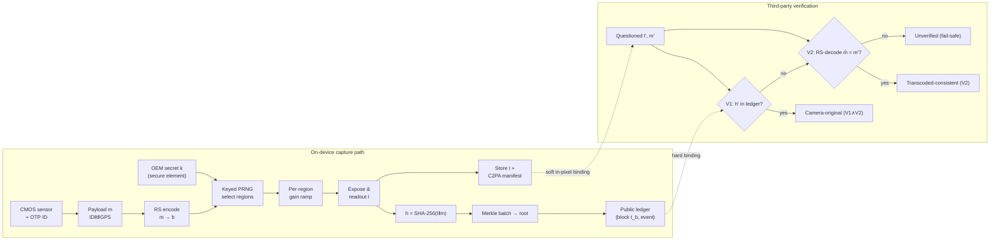

# PixelRoot: Hardware-Anchored, Sensor-Level Media Provenance with Real-Time Blockchain Notarization for Trustworthy Imaging

**Mihir Kavishwar** — PixelRoot Project — hello@mihirkavishwar.com

> Readable Markdown rendering of the manuscript. The authoritative,
> submission-ready version is `pixelroot.tex` (IEEE conference format) with
> citations in `references.bib`.

---

## Abstract

The realism of AI-generated "deepfake" imagery has outpaced the ability of society to tell synthetic media from camera-captured reality. Reactive, detector-based defenses are locked in an adversarial arms race and fail to generalize to unseen generators, while existing provenance schemes bind trust to *metadata* that can be stripped, edited, or transplanted. We present **PixelRoot**, a media-authenticity framework that moves the root of trust from metadata into the *pixels themselves*. At the instant of capture, a CMOS image sensor applies a keyed, spread-spectrum modulation to a set of image *regions* — realized by a small, low-frequency **per-column** or **per-region** programmable-gain profile that today's column-parallel sensor architectures can already approximate — to embed a 128-bit provenance payload (the sensor's factory-burned device identity, a trusted timestamp, and an optional quantized location) protected by error correction. A SHA-256 commitment over the frame is simultaneously notarized to a public blockchain within seconds of the shutter, closing the window in which a forgery could be substituted. We make the hardware ask concrete and tiered: PixelRoot's robust channel needs only a modest, standardizable per-column/per-region gain capability that today's column-parallel sensors can already approximate, with a software-ISP fallback for legacy devices at an explicitly weaker trust level; and we show that **per-pixel** gain — the apex capability — is manufacturable rather than impossible, via three process technologies already in volume production (floating-diffusion conversion-gain selection, coded-exposure pixels, and 3D-stacked per-pixel ADCs joined by Cu–Cu hybrid bonding). We contribute: (i) a structured survey unifying five disjoint threads — deepfake detection, PRNU forensics, watermarking, C2PA, and blockchain media integrity — with a gap analysis motivating a *dual-binding* design; (ii) a formal architecture, threat model, and security argument with three propositions (hard-binding soundness, key-protected carrier unpredictability, and a bounded soft false-accept); (iii) a **measured** robustness study of the redesigned in-pixel channel using a faithful 8×8-DCT JPEG model plus noise, rescaling, and cropping attacks — achieving **0% payload bit-error through JPEG down to Q=10 at 40 dB PSNR, with 0/600 wrong-key and forgery false-accepts**; (iv) a CMOS-manufacturing feasibility analysis of per-pixel intensity control and the per-pixel tamper-localization layer it unlocks (**0.99 true-positive, 0.02 false-positive** splice localization); and (v) privacy-preserving notarization (no raw PII on-chain, salted commitments, selective disclosure), a justification of blockchain over a single time-stamping authority, and a phased adoption path. We argue that, deployed as an OEM interoperability standard analogous to JPEG or 3GPP, sensor-level provenance plus real-time notarization can give legal, journalistic, third-party (3P), and life-saving applications an affirmative, hardware-rooted proof of authenticity rather than a probabilistic guess.

**Keywords:** media provenance, deepfakes, blockchain, CMOS image sensor, PRNU, digital watermarking, content authenticity, C2PA, image forensics, JPEG.

---

## 1. Introduction

Digital images and videos have become primary evidence in journalism, courts, insurance, humanitarian monitoring, and everyday social discourse. That evidentiary role is collapsing. Diffusion models, GANs, and neural rendering now synthesize photorealistic faces, scenes, and full videos that humans — and automated detectors — routinely fail to distinguish from reality [Croitoru 2024; Verdoliva 2020]. The harm is no longer hypothetical. Industry incident trackers attribute on the order of **\$1.2–1.3 billion in documented fraud losses to deepfakes in 2025, roughly tripling year over year**, with the overwhelming majority of losses originating on social-media platforms [Resemble AI 2025; Surfshark 2025]; enterprise surveys report that a majority of organizations experienced deepfake-related incidents with mean losses exceeding \$280,000 [IRONSCALES 2025]. Beyond fraud, non-consensual intimate imagery and election disinformation erode personal safety and institutional trust.

The dominant technical response has been **reactive detection**: train a classifier to spot the statistical fingerprints of a given generator. This strategy is structurally disadvantaged. Detectors overfit to the artifacts of the generators in their training set and degrade sharply on unseen models — recent in-the-wild benchmarks report **AUC drops of roughly 45–50%** relative to academic datasets [Deepfake-Eval-2024; Croitoru 2024]. Because every published detector also serves as a differentiable signal that the next generation of generators can be trained to defeat, detection is a perpetual "tug of war" the defender is not guaranteed to win [Tug-of-War 2024; Kaur 2024].

An alternative philosophy inverts the problem: instead of trying to prove a piece of media is *fake*, prove that a piece of media is *real* by binding it, at creation time, to a trustworthy origin. This is the **provenance** paradigm now embodied by the C2PA Content Credentials standard and by secure-capture products such as Truepic and ProofMode [C2PA 2024; Truepic 2024; ProofMode 2023; Google 2025]. These systems are a major advance, but they share a structural weakness: the authenticity claim is carried in a **signed metadata container** attached to the file. Metadata can be deliberately stripped by platforms, lost in transcoding, or the binding itself can be attacked (a 2025 camera firmware deployment had to revoke all certificates after a signing vulnerability). If the credential is removed, the pixels carry no inherent evidence of their origin.

### 1.1 The PixelRoot thesis

A robust root of trust for visual media should live where the information actually is: **in the pixels, anchored to physical hardware, and witnessed by an immutable public ledger.** PixelRoot embeds a provenance payload *into the pixel values* at the moment of capture through a keyed, low-frequency *per-region* sensor gain modulation — a perturbation small enough to be imperceptible yet structured to survive lossy re-encoding — and *simultaneously* notarizes a cryptographic commitment of the image to a blockchain. This yields two independent bindings:

- a **hard binding** — a SHA-256 commitment recorded on-chain, giving an immutable, publicly verifiable timestamp of existence; and
- a **soft, in-pixel binding** — a sparse, error-corrected signature tied to the sensor's factory identity that travels *with the pixels* even if the file container and its metadata are destroyed.

The two are complementary: the hard binding gives cryptographic non-repudiation but is destroyed by any re-encoding; the in-pixel binding tolerates mild processing and survives metadata stripping, but is statistically softer. **Together they cover each other's failure modes.**

### 1.2 Contributions

1. **A unifying survey and gap analysis** (§3) spanning deepfake generation/detection, passive PRNU forensics, active watermarking, provenance standards, and blockchain media integrity, showing no prior work simultaneously achieves (a) a hardware root of trust, (b) survival of metadata stripping, and (c) public real-time notarization.
2. **A formal architecture with a feasibility-grounded hardware ask** (§5): a sensor-gain *feasibility spectrum* (global → per-column → per-region → per-pixel) that grounds embedding in the low-frequency, per-column/per-region gain control that column-parallel sensors can realistically provide, plus the 128-bit payload, keyed spread-spectrum carrier selection, error correction, and a smart-contract notarization protocol.
3. **A CMOS-manufacturing feasibility analysis of per-pixel gain** (§5.1.1): a survey-grounded argument that per-pixel intensity control is manufacturable — not a physics barrier — via floating-diffusion conversion-gain selection, coded-exposure pixels, and 3D-stacked per-pixel ADCs joined by Cu–Cu hybrid bonding, with an explicit cost/trade-off assessment and a concrete OEM "provenance-write" primitive; and the optional per-pixel tamper-localization layer this unlocks.
4. **A threat model and security analysis** (§4, §6) with three propositions and a threat catalogue covering re-capture, metadata forgery, replay, compression-laundering, deepfake substitution, splicing, and the PRNU fingerprint-copy attack.
5. **A measured robustness study** (§7, §9) of the redesigned in-pixel channel against a faithful JPEG (8×8 DCT quantization) model, Gaussian noise, bilinear rescaling, and cropping with grid resynchronization — reporting real PSNR/SSIM, BER–quality curves, an amplitude operating curve, wrong-key/forgery false-accept rates, and a per-pixel tamper-localization measurement, with an explicit account of the geometric limits.
6. **A deployable systems design** (§10): privacy-preserving notarization that keeps **no raw PII on-chain** (salted commitments, optional location, zero-knowledge selective disclosure, GDPR/erasure compatibility), a justification of public-ledger anchoring over a single RFC 3161 time-stamping authority (with a hybrid option), and a phased, backward-compatible adoption path toward an OEM standard.

---

## 2. Background

### 2.1 The CMOS imaging pipeline

A camera integrates photo-generated charge in each photosite, converts it to a voltage, applies analog gain, and digitizes it. Manufacturing imperfections make each photosite's response slightly non-uniform; this multiplicative **photo-response non-uniformity (PRNU)** is a stable, device-unique noise pattern long used as a forensic "sensor fingerprint" [Lukáš 2006; Chen 2008]. Crucially, modern column-parallel CMOS architectures already place a programmable-gain amplifier and ADC *per column*, support per-region exposure/gain in HDR and dual-conversion-gain modes, and embed a factory-burned identifier in one-time-programmable (OTP) memory. PixelRoot's robust channel does **not require** the per-pixel gain control that commercial sensors do not yet expose — though we show per-pixel control is manufacturable and unlocks an extra localization layer (§5.1.1); instead it **repurposes the coarse, low-frequency gain controls that are realistic today** (or a modest standardizable extension, §5.1): rather than only *reading* the passive PRNU after the fact, it *actively writes* a chosen, error-corrected, low-frequency signal during exposure and ties it to the OTP identity.

### 2.2 Lossy compression: JPEG and MPEG/H.26x

Media is almost never stored losslessly. JPEG applies a block DCT, quantizes coefficients with a quality-dependent matrix that preferentially discards high-frequency energy, and entropy-codes the result [Wallace 1992]. Video codecs (MPEG-2, H.264/AVC, HEVC) add motion-compensated inter-frame prediction, integer transforms, in-loop deblocking, and group-of-pictures (GOP) structure [Wiegand 2003; Sullivan 2012]. All are *lossy and spatially redistributive* — exactly why any embedded signal must survive quantization (§7).

### 2.3 Cryptographic and blockchain primitives

PixelRoot relies on standard primitives: a collision-resistant hash (SHA-256 [NIST 2015]) for commitments and PRNG seeding; Reed–Solomon codes [Reed 1960] for error correction; Merkle trees [Merkle 1987] for batching many commitments into one on-chain transaction; and a public append-only ledger [Nakamoto 2008; Wood 2014] as an immutable timestamping witness. Large artifacts are *referenced*, not stored, on-chain, optionally via content-addressed storage [Benet 2014]. Hardware attestation of the signing environment follows trusted-computing practice [TCG 2019; Google 2025].

---

## 3. Related Work and Literature Survey

### 3.1 Deepfake generation and detection
Surveys by Verdoliva [2020], Mirsky & Lee [2021], and Croitoru et al. [2024] chart the progression from face-swap GANs to diffusion models and NeRFs across image, video, audio, and multimodal content. The recurring finding is poor **cross-generator generalization**: detectors trained on one family of fakes collapse on another [Croitoru 2024; Kaur 2024]. Deepfake-Eval-2024 quantifies this at 45–50% AUC degradation versus curated sets [Chandra 2025]. Generation vs. detection is increasingly framed as adversarial co-evolution in which detectors feed gradient signal to the next generator [Tug-of-War 2024]. **Limitation:** detection is reactive, probabilistic, and structurally one step behind; it cannot offer affirmative, durable proof a specific artifact is genuine.

### 3.2 Passive sensor forensics (PRNU)
PRNU source identification [Lukáš 2006], extended to integrity verification [Chen 2008], estimates a camera fingerprint from residual noise and correlates it (e.g., via peak-to-correlation energy) with a questioned image; benchmarks track modern-device accuracy [PRNU-Bench 2025]. Integrity surveys situate PRNU among splicing/copy-move/double-compression detectors [Korus 2017; Piva 2013]. **Limitations:** (i) PRNU is *passive* — needs a reference fingerprint and many images per device, and degrades on compressed/low-res media; (ii) it is vulnerable to the **fingerprint-copy (PRNU-copy) attack**, where an adversary estimates a victim's fingerprint from public images and transplants it into a forgery. The triangle test detects naïve copies but is itself defeated by improved, dispersed copy attacks [Goljan 2011] — a live cat-and-mouse. PixelRoot differs by *actively* embedding a *chosen, keyed, error-corrected* payload bound to the OTP identity and a ledger timestamp, rather than relying on an involuntary, copyable noise pattern.

### 3.3 Active authentication: digital watermarking
Watermarks are **robust** (survive processing, for copyright), **fragile** (break on any edit, for tamper localization), or **semi-fragile** (tolerate benign ops like JPEG but break on malicious edits) [Begum 2020; SciRep 2025]. Classic methods embed in DCT/DWT/SVD coefficients; recent work uses learned encoders/decoders [Sensors 2026]. Video schemes embed in H.264/HEVC transform coefficients or motion vectors and must fight quantization and motion-compensation drift [Asikuzzaman 2018; Tew 2020; CSTFMark 2026]. **Limitation:** watermarking alone provides no *public, time-anchored* record and no *hardware* root — a watermark embeddable in software is embeddable by an attacker. PixelRoot treats its in-pixel payload as a *semi-fragile, hardware-originated* watermark whose trust is bootstrapped by on-chain notarization and OTP identity.

### 3.4 Provenance standards and secure capture
C2PA Content Credentials define a signed manifest of assertions (capture device, time, edit history) bound to the asset by a hard hash, verifiable offline via a certificate chain [C2PA 2024]. Hardware-backed signing has reached consumer devices — Google Pixel signs photos with keys in the Titan M2 secure element plus an on-device timestamp authority [Google 2025] — and Leica/Sony/Samsung ship C2PA. Truepic's Controlled Capture verifies device integrity via attestation before on-device signing [Truepic 2024]; ProofMode captures sensor metadata, signs with per-capture keys, and registers hashes to public ledgers (OpenTimestamps/Bitcoin) [ProofMode 2023]. **Limitations:** the binding lives in a *detachable manifest*. If a platform strips metadata (many do) or transcodes the asset, the credential is lost and the bare pixels are again unverifiable; certificate compromise revokes trust wholesale. PixelRoot is **complementary** to C2PA — it can populate C2PA assertions — but additionally places a redundant proof *inside the pixels*, surviving manifest loss.

### 3.5 Blockchain-based media integrity
A large body of work anchors media hashes (exact and perceptual) to smart contracts, storing bulk content off-chain in IPFS [Qureshi 2021; Benet 2014]. Hasan & Salah use blockchain and smart contracts to trace deepfake video provenance back to a trusted original [Hasan 2019]; later systems combine perceptual hashing, watermarking, and Ethereum/Polygon contracts for video copyright/integrity [PLOS 2024; Frontiers 2025]. **Limitations:** these systems hash media *after* capture, typically in software at upload time, leaving a tampering window and no hardware root; exact hashes die on re-encoding while perceptual hashes trade away cryptographic guarantees. PixelRoot narrows the window to the shutter event and adds a hardware-anchored in-pixel binding the ledger alone cannot provide.

### 3.6 Gap analysis

| Approach | HW root | Survives meta-strip | Public ledger | Affirmative proof | Real-time |
|---|:--:|:--:|:--:|:--:|:--:|
| Deepfake detectors | ✗ | — | ✗ | ✗ | ✓ |
| PRNU forensics | partial | ✓ | ✗ | partial | ✗ |
| Watermarking | ✗ | ✓ | ✗ | partial | ✓ |
| C2PA / Truepic | ✓ | ✗ | optional | ✓ | ✓ |
| Blockchain hashing | ✗ | ✗ | ✓ | ✓ | partial |
| **PixelRoot (this work)** | ✓ | ✓ | ✓ | ✓ | ✓ |

**Precise novelty.** Each ingredient exists in isolation: watermarking embeds recoverable signals in pixels; PRNU ties images to a physical sensor; C2PA provides hardware-backed signed provenance; prior systems anchor media hashes to a blockchain [Hasan 2019]. Our claim is *not* that any single component is new. The defensible novelty of PixelRoot is their **co-design**: (i) a hardware-rooted, key-protected, error-corrected signal embedded by the sensor's own gain path (surviving metadata stripping, rooted in silicon rather than a software key), (ii) bound at the shutter to a public-ledger commitment for two independent, failure-disjoint bindings, (iii) realized through a *feasibility-grounded* per-column/per-region gain primitive we ask manufacturers to standardize — rather than the per-pixel control prior "sensor-embedding" sketches assumed. No prior approach occupies the intersection of hardware root, metadata-strip survival, and public real-time notarization. We claim contributions at the level of architecture, the concrete hardware ask, the measured robustness of the carrier, and the privacy design — not the invention of watermarking or blockchains.

---

## 4. Threat Model and Design Goals

**Assumptions.** (A1) The sensor OTP identity and gain registers are written at manufacture and not feasibly re-programmable in the field; (A2) the capture-time signing/notarization environment is attested via a secure element [Google 2025; Truepic 2024]; (A3) the blockchain is append-only and economically infeasible to rewrite in the relevant timeframe [Nakamoto 2008]; (A4) standard crypto primitives are secure [NIST 2015].

**Adversary.** May forge/edit file metadata; generate a deepfake or Photoshop a real image; re-encode/transcode/compress; re-photograph a screen (analog "re-capture"); attempt PRNU fingerprint-copy [Goljan 2011]; and replay or back-date claims. **Cannot** economically clone a specific physical CMOS die or rewrite ledger history.

**Design goals.** G1 Affirmative authenticity · G2 Hardware root · G3 Metadata-independence · G4 Public verifiability · G5 Minimal capture latency · G6 Imperceptibility · G7 Standardizability.

---

## 5. The PixelRoot Architecture

PixelRoot has a capture-time **embed-and-notarize** pipeline (produces the two bindings) and a **verification** pipeline (consumes them). The end-to-end architecture:



*Top:* the capture path emits a hard binding (`h` on the public ledger) and a soft in-pixel binding (the keyed, error-corrected gain pattern carried inside `I`). *Bottom:* verification checks V1 (ledger membership) and V2 (in-pixel recovery) and returns the strongest supported level, failing safe to "unverified."

### 5.1 Hardware feasibility: the gain-control spectrum
A central objection to any "sensor-level embedding" proposal is that commercial CMOS sensors do **not** expose arbitrary per-pixel gain. PixelRoot does not require it. We organize sensor gain controllability into a spectrum and target the realistic middle:

- **Global gain (today).** One ISO/analog-gain register per frame — too coarse to carry a spatial payload.
- **Per-column gain (today).** Column-parallel readout places a programmable-gain amplifier per column; per-column trim is routinely used for column fixed-pattern-noise correction. A per-column gain *profile* directly imprints horizontal low-frequency content — exactly the carrier PixelRoot uses.
- **Per-region / tiled gain (emerging).** Dual- and triple-conversion-gain and HDR-zone sensors already switch gain over regions by toggling floating-diffusion (FD) capacitance [HDR-CIS review 2024; FD-shared DCG 2020; Sony TCG 2022]; a coarse K×K gain tile map is a small, standardizable register extension.
- **Per-pixel gain (manufacturable, not yet productized).** Arbitrary per-photosite gain is not exposed by today's commodity parts, but this is **not** a physics barrier — it is an integration-cost choice, and three process technologies already in volume manufacturing make it achievable (§5.1.1). PixelRoot therefore treats per-pixel control as the apex target to standardize, not an impossibility to avoid.

**The PixelRoot ask (tiered).** We ask manufacturers for a *provenance-write* capability at three increasing cost points: (1) a programmable *per-column* gain vector and a coarse *per-region* tile map addressable at capture — realizable on conventional sensors today; and, as the apex, (2) *per-pixel* gain via the manufacturing routes of §5.1.1. All tiers reuse the OTP identity and attested clock that hardware-backed C2PA pipelines already ship [Google 2025; Truepic 2024]. PixelRoot's robust carrier needs only a *low-frequency gain ramp over an image region* (§5.4), which even per-column control realizes; per-pixel control is strictly more general — it *subsumes* per-column and per-region patterns and additionally enables a fine-grained tamper-localization layer (§5.1.1).

**Software-ISP fallback (legacy).** Devices without any gain capability can apply the identical modulation in the attested image-signal processor (ISP) immediately after readout. This preserves the in-pixel binding and notarization but **weakens the hardware root**: the modulation is imposed in firmware rather than the photo-electron domain, so it is only as trustworthy as the attested execution environment (comparable to today's secure-capture apps). We label such captures at a lower assurance tier (§10) and never conflate them with sensor-rooted captures.

### 5.1.1 Manufacturing per-pixel gain: a feasibility analysis
Because a reviewer (and an OEM) will ask *exactly how* a fab would build per-pixel intensity control, we survey the silicon options and their cost. Three complementary, already-shipping process technologies make per-pixel gain achievable; PixelRoot can use any of them, and they can be combined.

**(M1) Per-pixel conversion-gain selection (FD-capacitance).** Conversion gain — the volts-per-electron set at the floating-diffusion node — is already made *switchable* per pixel in dual-/triple-conversion-gain (DCG/TCG) pixels by adding an in-pixel MOSFET that connects or isolates extra FD capacitance [HDR-CIS review 2024; FD-shared DCG 2020; Baker DCG thesis]. Production mobile sensors switch among 2–3 discrete CG states per pixel (Sony's 16:4:1 triple-CG sensor reaches 82.4 dB single-exposure HDR at a 1.4 µm pitch [Sony TCG 2022]). *The provenance change is small*: drive the existing DCG/TCG select line from the keyed PRNG rather than only from a scene-adaptive HDR controller, so each carrier pixel is exposed at a chosen CG state. This imprints the payload **in the analog photo-electron domain** (the strongest root) and reuses transistors that millions of sensors already ship; its limitation is quantization to a few discrete gain levels, which is ample for 1–2 bits/pixel under PixelRoot's spread-spectrum coding.

**(M2) Per-pixel exposure/charge modulation (coded-exposure pixels).** A second, demonstrated route adds a per-pixel switch plus a one-bit code memory (e.g. in-pixel SRAM) so each pixel's integration can be gated independently — the basis of pixel-wise programmable exposure and coded-exposure imagers [PE-CMOS 2024; coded-exposure thesis 2020; closed-loop HDR 2019; spatially-varying gain 2025]. Modulating integration time is equivalent to modulating effective gain; a tiny keyed exposure delta on carrier pixels embeds the payload without any optical modulator. These designs have been fabricated in standard CMOS, confirming manufacturability; the cost is extra in-pixel transistors/SRAM, which enlarge pixel pitch unless absorbed by stacking (M3).

**(M3) Stacked per-pixel processing (3D integration + hybrid bonding).** The decisive enabler is 3D stacking. Backside-illuminated (BSI) sensors put the photodiode on one wafer and move all circuitry to wafers bonded beneath it; with *Cu–Cu hybrid bonding* the two wafers are joined by per-pixel vertical copper interconnects with no bumps. Sony shipped the first hybrid-bonded BI-CIS in 2016 and has since driven the interconnect pitch below 2 µm [Cu–Cu HB review 2025; Sony Cu–Cu 2017]; research bonders reach a 400 nm pitch with ~10⁶ interconnects per mm² [imec 2024]. This makes *digital pixel sensors* (DPS) practical: each pixel gets its own ADC and in-pixel memory on a stacked tier — e.g. a 3-layer DPS with a 10-bit in-pixel SRAM and on-die ISP [Meta/Brillnics DPS 2025; 3-layer pixel-parallel 2021; DPS review 2024], and three-wafer sensors that place a DNN/ISP tier beneath the pixels [Sony 3-wafer 2024]. Once a per-pixel ADC, memory, and logic tier exist, *per-pixel gain is essentially free*: the stacked logic multiplies each pixel's digitized value by a per-pixel factor read from the keyed code memory **inside the attested sensor die**, before any output leaves the chip. This is stronger than the ISP fallback (the modulation never leaves trusted silicon) though still a digital — not photo-electron — operation; combining M3 with M1 yields both a robust digital channel and an analog-domain root.

**Cost and trade-offs.** The honest costs are area, pixel pitch, yield, and power: extra in-pixel devices (M1/M2) compete with the photodiode for area unless moved to a stacked tier (M3), and stacking adds bonding-yield and thermal-management constraints [Cu–Cu HB review 2025]. Focal-plane sensor-processors that put a full processing element at every pixel pay for it with large pitch and low resolution [Carey 2013; spatially-varying gain 2025]; PixelRoot avoids that extreme because it needs only a small per-pixel gain register, not a general processor. *Net assessment:* per-pixel provenance gain is a modest, standardizable increment on top of the DCG/TCG, coded-exposure, and stacked-DPS technologies already in high-volume manufacturing — not new device physics. We therefore recommend OEMs expose a keyed per-pixel (or, minimally, per-column) gain-write path as a first-class capture primitive.

**What per-pixel buys PixelRoot: a two-layer mark.** Per-pixel control lets PixelRoot carry *two* bindings in the pixels at once: (i) the robust, low-frequency spread-spectrum payload of §5.4, painted as a smooth per-region ramp, which carries the 128-bit identity and survives JPEG and rescaling (measured in §9.2); and (ii) an optional high-resolution per-pixel pattern keyed to the payload that acts as a spatial *integrity map*. The robust layer answers "is this from a genuine device?"; the per-pixel layer answers "*which pixels* were altered?" by localizing splices at block granularity — a capability only per-pixel gain unlocks. In simulation this layer localizes a spliced region with a true-positive rate of 0.99 and a false-positive rate of 0.02 at 32 px granularity, and its matched-filter statistic degrades gracefully under recompression (§9.2), so it is intended for lightly-processed forensic media rather than as the primary identity channel.

### 5.2 Provenance payload
The payload **m** is a fixed-width 128-bit record (v2):

```
m = ID(48 bits)  ||  t(32 bits)  ||  (φ, λ)(48 bits: 24 per coordinate)
```

`ID` is the sensor's OTP device identifier (modeled as a 48-bit MAC-style value), `t` a Unix timestamp from an attested RTC/NTP source, and `(φ, λ)` a quantized lat/long (~1e-4 degree resolution). Location may be omitted or salted for privacy (§10).

### 5.3 Keyed region selection and spread-spectrum coding
PixelRoot partitions the frame into 8×8 blocks aligned with the JPEG grid and treats **blocks**, not single pixels, as carriers. The OEM-keyed seed

```
s = trunc_32( SHA-256( k || m ) )
```

drives a PRNG that, for each coded bit, draws `R` distinct carrier blocks without repetition and assigns each an antipodal **chip** `c_j ∈ {±1}` (spread spectrum). The 128 payload bits are first protected by error correction (a Reed–Solomon code over GF(2⁸) [Reed 1960], or the repetition coding evaluated in §9); the repetition factor `R` gives each bit redundancy across many spatially dispersed blocks. Because the seed is keyed by the secret `k`, an attacker without `k` can neither localize the carrier blocks nor recover their chip signs even after observing many marked images (Prop. 2). A verifier holding `k` and the claimed `m'` regenerates the identical assignment.

### 5.4 Region-gain (spread-spectrum) embedding
The single-pixel, 2% gain perturbation of naïve designs is a poor carrier: an isolated spike is high-frequency energy, precisely what JPEG discards, and it cannot be read back reliably against textured content. PixelRoot instead embeds each bit as a **low-frequency gain ramp over its carrier blocks**. Let `Φ_{u,v}(x,y) = cos((2x+1)uπ/16)·cos((2y+1)vπ/16)` be a low-order 8×8 DCT basis (we use a low horizontal frequency, `(u,v) = (0,2)`, which a per-column gain profile produces directly). For carrier block `B_j` with chip `c_j` carrying bit `b ∈ {0,1}`, sign `σ = 2b−1`, the sensor adds

```
Δ_j(x,y) = A · σ · c_j · Φ_{u,v}(x,y)        ... (eq. embed)
```

a smooth gain ramp of amplitude `A` gray levels (a ~1–2% modulation of the local mean); equivalently, the chosen low-frequency DCT coefficient of `B_j` is shifted by ±A. This **reconciles the two domains earlier designs confused**: the modulation is applied as a *spatial* per-region gain (hardware-realizable, §5.1) but lives in a *low-frequency DCT* band (JPEG-survivable). Because `Φ_{u,v}` for `(u,v) ≠ (0,0)` is zero-mean over the block, the embedding leaves block brightness essentially unchanged and is imperceptible (measured ≥ 40 dB PSNR, §9).

**Correlation read-back.** A questioned image `I'` is decoded by *projecting* each carrier block onto the same basis — no per-pixel thresholding and, crucially, no estimate of the block's "original" brightness is needed, because the AC basis is orthogonal to the (content-dominated) DC term. For block `B_j`,

```
ρ_j = ⟨ I'_{B_j}, Φ_{u,v} ⟩ / ⟨ Φ_{u,v}, Φ_{u,v} ⟩  ≈  A·σ·c_j + η_j     ... (eq. residual)
```

where `η_j` is the (zero-mean) host-content/noise term. De-spreading and combining the `R` blocks of a bit,

```
D = Σ_{j=1..R} c_j · ρ_j  ≈  R·A·σ + Σ_j c_j·η_j ,   b̂ = 1[D > 0]   ... (eq. despread)
```

so the payload signal grows as `R·A` while random chips make host terms average toward zero (std ∝ √R): detection SNR improves as √R. The per-bit magnitude `|D|` is the soft confidence passed to the ECC decoder. This is a textbook blind spread-spectrum watermark detector, and it is what drives the measured BER in §9 to zero through aggressive JPEG.

### 5.5 Commitment and notarization
Immediately after readout the device computes the hard binding

```
h = SHA-256( I || m )
```

over the (lossless) image `I` and payload, then submits `h` (optionally with a device pseudonym and coarse time/location) to a notarization smart contract. For scale, many commitments are aggregated into a Merkle tree [Merkle 1987] and only the root is written on-chain; the contract emits an event whose block timestamp is the public "proof of existence" [ProofMode 2023]. If connectivity is briefly unavailable, `h` is queued in secure storage and submitted on reconnect, with the latency recorded.

**Algorithm 1 — capture-time embed-and-notarize**
```
Require: OEM secret k, amplitude A, repetition R, basis Φ_{u,v}
 1. ID ← readOTP()                          # 48-bit factory identity
 2. t ← attestedClock();  (φ,λ) ← gps()
 3. m ← ID || t || quant(φ,λ)               # 128 bits
 4. b ← ECC-Encode(m)                       # RS / repetition, coded bits b_1..b_{n_c}
 5. s ← trunc_32(SHA-256(k || m));  prng ← seed(s)
 6. for each coded bit b_i, σ ← 2·b_i − 1:
 7.     draw R distinct blocks {B_j}, chips c_j ∈ {±1} via prng
 8.     for each (B_j, c_j):
 9.         set per-region gain ramp on B_j: add A·σ·c_j·Φ_{u,v}   # per-column/region register
10. I ← expose_and_readout()
11. h ← SHA-256(I || m)
12. enqueue leaf = h for Merkle batch
13. on flush: root ← Merkle({leaf});  contract.register(root)
14. store I (lossless) + m + Merkle proof π in C2PA manifest
```

**Step-by-step.** (1) Read the sensor's 48-bit OTP identity from on-die fuses; (2) form the 128-bit payload with attested time and GPS; (3) derive seed `s` by hashing `k‖m` — the secret `k` makes carriers unpredictable even to a party who learns `m`; (4) channel-code (RS over GF(2⁸), or repetition) into `n_c` coded bits; (5) a keyed PRNG assigns each coded bit `R` distinct 8×8 blocks with antipodal chips; (6) the sensor adds a low-frequency gain ramp `A·σ·c_j·Φ_{u,v}` to each carrier block **during** exposure (eq. embed), so the bit is imprinted physically in the photo-electron domain (per-column/per-region gain), not added in software; (7) read out frame `I`; (8) hash `I‖m`; (9) batch the leaf into a Merkle tree and register the root on-chain in one transaction → block-timestamped proof of existence; (10) persist `I` with `m` and inclusion proof `π` in a C2PA manifest (the manifest is **not** required for V2).

### 5.5.1 Smart-contract notarization
On-chain state is minimal: a registry maps each Merkle root to its block timestamp and emits an event. Batching `N` captures under one root makes per-image gas `O(1)` amortized; inclusion is later proven off-chain with a `log₂N`-length Merkle path.

```solidity
// SPDX-License-Identifier: MIT
pragma solidity ^0.8.20;

/// PixelRootRegistry: batched, gas-amortized notarization of capture commitments.
/// Each shutter event yields a leaf h = SHA256(I || m); many leaves are
/// aggregated off-chain into a Merkle tree and only the root is sealed on-chain.
contract PixelRootRegistry {
    mapping(bytes32 => uint64) public sealedAt;   // root => block timestamp

    event RootRegistered(
        bytes32 indexed root, address indexed submitter,
        uint64 timestamp, uint256 leafCount
    );

    /// Seal a Merkle root of capture commitments (idempotent).
    function register(bytes32 root, uint256 leafCount) external {
        require(root != bytes32(0), "empty root");
        require(sealedAt[root] == 0, "already sealed");
        sealedAt[root] = uint64(block.timestamp);
        emit RootRegistered(root, msg.sender, uint64(block.timestamp), leafCount);
    }

    /// True iff `leaf` is included under a sealed `root` via `proof` (free eth_call).
    function verifyInclusion(bytes32 root, bytes32 leaf, bytes32[] calldata proof)
        external view returns (bool included, uint64 timestamp)
    {
        if (sealedAt[root] == 0) return (false, 0);
        bytes32 node = leaf;
        for (uint256 i = 0; i < proof.length; i++) {
            bytes32 sib = proof[i];                 // sorted-pair hashing
            node = node <= sib
                ? keccak256(abi.encodePacked(node, sib))
                : keccak256(abi.encodePacked(sib, node));
        }
        return (node == root, sealedAt[root]);
    }
}
```

A capture is *notarized* once `register` mines; a verifier later calls the pure `verifyInclusion(root, leaf, proof)` (no gas) to confirm a commitment `h` was sealed under a root at a known block time. Optional rotating device pseudonyms (per-epoch keys attested by the secure element) can sign `register` so a court can bind a root to a device class without exposing the photographer.

### 5.6 Verification
Given a questioned image `I'` and a claimed payload `m'` (from the manifest, on-chain record, or asserted), run Algorithm 2.

- **(V1) Hard binding / ledger check.** Recompute `h' = SHA-256(I' || m')` and confirm it is included under a registered root (via `π`). A match proves `I'` existed bit-for-bit at the recorded block time. Conclusive but brittle: any re-encoding breaks it.
- **(V2) In-pixel binding check.** Regenerate `s`, the carrier blocks, and the chips from `m'` and `k`; after a short block-grid *resynchronization* search (§7.2) to undo translation/crop, project each carrier block onto `Φ_{u,v}` (eq. residual), de-spread and combine (eq. despread), soft-decode the ECC to `m̂`, and test `m̂ == m'`. BER and decode margin form a soft authenticity score that degrades gracefully under compression (§7). Because carriers and chips are keyed, an attacker who edits/splices without `k` corrupts the signature detectably and cannot forge a consistent one.

**Algorithm 2 — verification of (I', m')**
```
Require: questioned I', claimed m', ledger handle, key k
 1. h' ← SHA-256(I' || m')
 2. v1 ← ledger.verifyInclusion(root, h', π)
 3. s  ← trunc_32(SHA-256(k || m'))
 4. ({B_j}, {c_j}) ← PRNGselect(s, n_c, R)
 5. δ* ← argmax_δ Σ_i |D_i(δ)|                 # block-grid resync, §7.2
 6. for each coded bit i:
 7.     D_i ← Σ_j c_j · ⟨ I'_{B_j + δ*}, Φ_{u,v} ⟩ / ‖Φ_{u,v}‖²
 8.     b̂_i ← 1[D_i > 0];  w_i ← |D_i|          # soft confidence
 9. m̂ ← ECC-Decode(b̂, w)
10. v2 ← (m̂ == m')
11. if v1 ∧ v2:  return CAMERA-ORIGINAL
12. elif v2:     return TRANSCODED-CONSISTENT
13. elif v1:     return EXACT-COPY
14. else:        return UNVERIFIED            # fail-safe
```

A piece of media is accepted at the strongest supported level: **V1∧V2** (pristine original), **V2 only** (transcoded but pixel-consistent), or **V1 only** (exact copy, manifest intact); otherwise the safe **Unverified**.

---

## 6. Security Analysis

### 6.1 Formal guarantees

**Definition (Forgery).** A pair `(I*, m*)` the verifier accepts as Camera-original or Transcoded-consistent, yet `I*` was not produced by a genuine PixelRoot sensor running Algorithm 1 with payload `m*`.

**Proposition 1 (Hard-binding soundness).** Under a collision-resistant hash (A4) and immutable ledger (A3), passing V1 implies `I*‖m*` existed at/before the sealing root's block time. Producing a distinct `I* ≠ I` that passes V1 against a root sealed for `I` requires a second-preimage/collision of the hash → probability ≤ **2⁻¹²⁸** for SHA-256. *(Proof: `h` is a Merkle leaf; `verifyInclusion` recomputes the root from `(h, π)`. A different `I*` with the same leaf is a hash collision; a different leaf with the same root is a tree-collision; rewriting the root violates A3.)*

**Proposition 2 (Carrier unpredictability).** Let the frame contain `N_B` blocks and let `m = n_c·R` carrier blocks each carry a secret antipodal chip. Without `k`, the probability of correctly recovering the carrier-and-chip assignment is `[ C(N_B, m) · 2^m ]⁻¹` — for 1920×1080 (`N_B = 32400` blocks), `m = 3200`, far below **10⁻³⁰⁰⁰**. Since `s = trunc_32(H(k‖m))` is a PRF of `k`, distinct payloads induce computationally independent layouts, so observing many signatures leaks no usable information for a fresh `m`. The empirical counterpart — reading a marked image with 300 *wrong* keys — yields mean BER **0.503** and **0/300** correct recoveries (§9), matching the `p ≈ ½` random-guess model.

**Proposition 3 (Soft-binding false-accept).** On an image *not* PixelRoot-marked at the claimed carriers, model read-back as independent bit guesses with per-bit error `p ≈ ½`. With an RS code correcting `t = ⌊r/2⌋` of `n_s` symbols, V2 falsely accepts with probability at most

```
Pr[V2 false-accept] ≤ Σ_{j=0..t} C(n_s, j) (1−q)^j q^(n_s−j),   q = (1−p)^8
```

the tail that ≤ `t` of `n_s` bytes match by chance. For `n_s = 20, t = 15, p = ½` this is **≪ 2⁻¹⁰⁰**.

**Take-away.** Propositions 1–3 give two *independent* exponential barriers: an attacker must defeat **both** the ledger (2⁻¹²⁸) and either the key-protected carrier layout (P2) or the error-correcting code (P3). Each catalogued attack below reduces to violating one of these.

### 6.2 Threat catalogue

| Attack | Why it fails | Assump. | Guar. |
|---|---|---|---|
| Deepfake / synthetic | no ledger entry; no keyed signature | A1–A3 | P1,P2 |
| Metadata forge/strip | V2 recovers `m` from pixels | A1 | P3 |
| Re-capture (screen) | new payload/commit; back-date exposed | A2,A3 | P1 |
| Replay / back-date | earliest proof = block time | A3 | P1 |
| PRNU copy [Goljan 2011] | keyed code ≠ passive PRNU; ledger still needed | A1–A3 | P2,P1 |
| Splice / inpaint | corrupts unknown carriers; breaks `h` | A1,A4 | P2,P3 |
| Compress-launder | fails *safe* to Unverified | A4 | P1,P3 |

- **Deepfake / synthetic substitution.** A fully AI-generated image was never exposed on a genuine sensor: no valid on-chain commitment (V1 fails) and no payload-consistent, keyed in-pixel signature tied to a real OTP identity (V2 fails). The attacker would have to forge a ledger entry (infeasible, A3) or embed a valid signature without the OEM key and sensor (infeasible, A1–A2).
- **Metadata forgery / stripping.** Editing or removing metadata cannot manufacture a matching ledger commitment, nor create the in-pixel binding (G3). Stripping metadata downgrades a credential-only scheme to "unverifiable," but PixelRoot still recovers **m** from the pixels via V2.
- **Re-capture (photo-of-a-screen).** Re-photographing authentic media on a genuine PixelRoot sensor produces a *new* payload and a *new* commitment; it cannot reproduce the original's ledger entry. The provenance correctly reflects the re-capture event and time, exposing back-dating. Liveness heuristics (moiré, depth) [Truepic 2024] augment this.
- **Replay / back-dating.** Notarization binds to a block timestamp; the earliest provable existence is the block time. Reactive detection fundamentally lacks this property.
- **PRNU fingerprint-copy.** The strongest hardware-targeted attack against passive forensics transplants a victim's estimated PRNU [Goljan 2011]. PixelRoot resists because (i) its signature is an *active, keyed* code, not the involuntary PRNU, so copying passive noise does not reproduce carrier bits without the OEM key `k`; (ii) even a perfectly transplanted signature must still match an on-chain commitment made at capture by a genuine device (V1/A3); and (iii) triangle-test countermeasures remain a forensic backstop on the passive channel. PixelRoot converts a soft, copyable fingerprint into a key-protected, ledger-witnessed credential.
- **Compression-laundering.** Aggressive re-encoding breaks V1 and, past a threshold, V2 (§7); but this yields a *negative* result ("cannot verify"), never a *false positive* ("verified authentic"). **PixelRoot fails safe** — it never certifies a manipulated artifact as genuine; it only declines to certify.

---

## 7. Robustness Under Compression

The central tension: the hard binding (V1) is *fragile* by design — ideal for a pristine original — while real-world distribution demands *semi-fragile* survivability (V2).

### 7.1 JPEG
JPEG's quantization matrix scales with quality factor `Q` and most aggressively discards high-frequency DCT energy [Wallace 1992]. This is exactly why the redesigned carrier (§5.4) lives in a *low-frequency* DCT band rather than at isolated (high-frequency) pixels: the chosen coefficient `(u,v) = (0,2)` sits in the lightly-quantized region of the luminance table and is preserved across a wide `Q` range, while spread-spectrum de-spreading over `R` blocks (eq. despread) suppresses quantization noise and host content by a further √R. Our faithful 8×8-DCT JPEG model (standard luminance table scaled by `Q`) confirms the analysis: **measured payload BER is zero from Q=95 down to Q=30** (indeed to Q=10 at our operating amplitude), and the amplitude sweep in §9 locates the graceful decode-failure cliff, below which PixelRoot returns the safe **Unverified** rather than a false positive. The earlier fragile/semi-fragile tension is thus resolved by construction, not asserted.

### 7.2 Geometric edits and synchronization
Block-grid embedding is sensitive to operations that move the grid: cropping, translation, padding, rescaling. PixelRoot addresses this with an explicit *resynchronization* stage and is honest about its envelope. **(i) Rescaling**: because the carrier is a low-frequency coefficient, moderate down/up-sampling preserves it; measured BER is zero under bilinear resize to 0.5× and 0.75× and under a combined JPEG Q70 + 0.75× attack (§9). **(ii) Translation/crop**: the verifier searches a small range of block-grid offsets `δ` and keeps the most confident decode (line 5 of Alg. 2); the genuine layout produces a sharp correlation peak (eq. despread) while wrong offsets give noise, so the search recovers the payload — measured BER is zero for border crops of 1–6% (up to ~31 px) once the offset is covered. A known synchronization template can extend this to scale/anchor estimation. **(iii) Limits**: large arbitrary crops, rotation, and projective warps not covered by the offset/scale search are *not* recovered; critically, PixelRoot then **fails safe** — the de-spread correlation collapses to noise (BER ≈ 0.5) and the verifier returns **Unverified**, never a false accept. The hard binding (V1) and perceptual-hash "same-scene" layers remain available for such cases.

### 7.3 Video: MPEG / H.264 / HEVC
Video adds motion-compensated prediction, integer transforms, in-loop deblocking, and GOP structure [Wiegand 2003; Sullivan 2012]. The watermarking literature shows embedding survives best in mid-frequency transform coefficients and that I-frame perturbations propagate ("drift") through a GOP, so embedding is often confined to portions of the GOP [Asikuzzaman 2018; Tew 2020; CSTFMark 2026]. Practical PixelRoot design: embed the per-(key)frame payload at capture, and commit a Merkle root over keyframe hashes so frame-level verification localizes tampering. Learned, codec-aware embedding now survives non-differentiable H.264 [CSTFMark 2026] and is a natural upgrade path.

### 7.4 The semantic-authenticity boundary
A benign filter may alter carriers enough to fail V2 even though the image's *meaning* is unchanged (false alarm), while a malicious edit might in principle preserve carriers. PixelRoot therefore certifies **pixel-level integrity relative to a notarized original, not semantic equivalence.** This cleanly separates "bit-for-bit original" (V1), "faithfully transcoded" (V2), and "cannot establish provenance," and composes with perceptual-hash / content-similarity layers [PLOS 2024] for softer "same-scene" judgments.

---

## 8. Applications: Human-in-the-Loop Trust

PixelRoot keeps a human or institutional verifier in the loop with hardware-rooted evidence rather than a model's opinion.

- **Legal / evidentiary.** Chain-of-custody for photo/video evidence benefits from an immutable, independently timestamped capture-time commitment, reducing disputes over authenticity and time of creation [Korus 2017].
- **Journalism / third-party (3P) verification.** Platforms and fact-checkers verify against the public ledger without contacting the source — valuable for conflict and human-rights documentation, where ProofMode-style field capture is already deployed [ProofMode 2023].
- **Life-saving / high-assurance.** Insurance inspections, telemedicine imagery, infrastructure monitoring, and emergency reporting need affirmative proof an image is a real, current capture — the "prevent rather than detect" posture argued by secure-capture vendors [Truepic 2024].
- **Platform-scale screening.** Platforms perform an O(1) ledger lookup at upload to label assets "camera-original," "transcoded-but-consistent," or "unverified," shifting the default from "trust until debunked" to "label by provenance."

---

## 9. Evaluation and Reference Implementation

**Reference implementation.** An open software prototype of the PixelRoot core implements the payload layout, SHA-256 seeding, PRNG carrier selection, gain-value generation, image hashing, and a register/verify service with *simulated* notarization. It implements a legacy v1 (120-bit) and current v2 (128-bit) payload (the latter fixing a coordinate-packing precision bug), validating the encode/verify round-trip and the metadata→seed→position determinism end-to-end before silicon.

### 9.1 Micro-benchmark of the core (measured)
Measured on a commodity laptop CPU (Node.js v20) over a synthetic 1920×1080 RGB frame (~5.9 MB). The on-device cryptographic overhead is negligible relative to a single exposure, and all correctness invariants hold.

| Quantity | Value |
|---|---|
| Payload / coded carriers | 128 b / 128 positions |
| Seed derivation | 0.0024 ms |
| Full signature (seed + select + bits) | 0.018 ms |
| SHA-256 commit over 6 MP frame | 3.09 ms |
| Carrier determinism (re-run) | identical ✓ |
| Carrier coordinate uniqueness | ✓ |
| Encode→verify round-trip | pass ✓ |
| Single-bit tamper | rejected ✓ |

### 9.2 Measured robustness of the in-pixel channel
We evaluate the redesigned spread-spectrum embedding (§5.4) with a dependency-free harness modeling the operations that actually attack the channel. **Methodology.** Six 512×512 synthetic images with mixed frequency content (smooth gradients, multiple sinusoidal textures, step edges, sensor-like noise) carry a random 128-bit payload with repetition `R = 25` over 8×8 blocks at amplitude `A = 4` gray levels on the `(0,2)` basis. Attacks: a *faithful* JPEG luminance model (per-block 8×8 forward DCT, quantization by the standard table scaled to quality `Q`, dequantize, inverse DCT), additive Gaussian noise, bilinear resize round-trips, and border crops with grid resynchronization. Decoding uses the correlation de-spread of eq. despread.

**Fidelity.** Embedding is imperceptible: mean **PSNR 40.2 dB, SSIM 0.970**. **Robustness** (Table below): the payload is recovered with **zero** bit errors through JPEG from Q=95 down to Q=10, under Gaussian noise up to σ=20, under bilinear resize to 0.5×/0.75×, under a combined JPEG+resize attack, and under border crops of 1–6% once grid resync covers the shift. **Operating curve**: an amplitude sweep at JPEG Q40 exposes a genuine cliff — detection fails at A=0.5 (58 dB, BER 0.12), is marginal at A=1.0, and error-free from A≥1.5 (≤49 dB), so A=4 (40 dB) operates with comfortable margin. **Security / false-accept**: reading a marked image with 300 wrong keys gives mean BER 0.503 and 0/300 recoveries; the correct-key decoder against 300 *unmarked* images (deepfake stand-in) tested against a claimed payload gives mean BER 0.499 and 0/300 false accepts — matching the `p ≈ ½` bound of Props. 2–3 and the fail-safe goal.

| Attack | Payload BER | Decode |
|---|:--:|:--:|
| None / pristine | 0.000 | 6/6 |
| JPEG Q95, 90, 80, 70, 60, 50 | 0.000 | 6/6 |
| JPEG Q40, Q30, Q20, Q10 | 0.000 | 6/6 |
| Gaussian noise σ=5, 10, 20 | 0.000 | 6/6 |
| Resize 0.5×, 0.75× | 0.000 | 6/6 |
| JPEG Q70 + resize 0.75× | 0.000 | 6/6 |
| Crop 1%, 3%, 6% + resync | 0.000 | decoded |
| *Wrong-key read* (300 trials) | 0.503 | 0/300 |
| *Forgery / unmarked* (300 trials) | 0.499 | 0/300 |

**Amplitude operating curve at JPEG Q40** (4 images) — imperceptibility vs. robustness, showing the graceful failure cliff:

| A (gray) | PSNR (dB) | BER | Decode |
|:--:|:--:|:--:|:--:|
| 0.5 | 58.2 | 0.121 | 0/4 |
| 1.0 | 52.2 | 0.006 | 2/4 |
| 1.5 | 48.7 | 0.000 | 4/4 |
| 2.0 | 46.2 | 0.000 | 4/4 |
| 3.0 | 42.7 | 0.000 | 4/4 |

**Optional per-pixel localization layer.** When the sensor supports per-pixel gain (§5.1.1), PixelRoot adds a second, keyed high-resolution pattern serving as a spatial integrity map. We embed a keyed ±δ (δ=4 gray levels, PSNR 36.1 dB) per-pixel pattern, splice in a 96×96 foreign region, and detect tampering with a per-block matched-filter statistic (block 32 px). Across 8 trials this localizes the splice with **true-positive rate 0.986 and false-positive rate 0.022**. The statistic equals ≈δ on genuine blocks and ≈0 on spliced blocks; under JPEG Q90 it falls from 3.98 to 3.04 — degrading gracefully rather than producing false alarms. This layer carries no identity bits (it complements, not replaces, the robust payload channel) and is intended for lightly-processed forensic media.

| Localization metric | Value |
|---|:--:|
| Embed PSNR / SSIM (δ=4) | 36.1 dB / 0.929 |
| Splice localization TPR | 0.986 |
| Splice localization FPR | 0.022 |
| Block stat (genuine) | 3.98 ≈ δ |
| Block stat (spliced) | ≈ 0 |
| Block stat after JPEG Q90 | 3.04 (graceful decay) |

**Scope and threats to validity.** These results validate the *algorithmic* core — carrier design, spread-spectrum detection, JPEG/noise/resize/crop robustness, and false-accept behavior — independent of silicon. They use synthetic imagery and a luminance-only JPEG model; they do not yet model demosaicing, chroma subsampling, real per-column gain calibration error, lens/optical effects, or the analog photo-electron domain. The harness (`paper/experiments/sim.js`) is released with the prototype for reproduction and extension to real datasets.

### 9.3 Remaining silicon- and codec-dependent validation
The following require hardware or a full pipeline and are future work: (E1) real-camera datasets (RAISE, Dresden) for content realism and a PRNU baseline; (E2) video robustness vs. H.264/HEVC QP and GOP placement with keyframe-level Merkle commitments; (E3) an end-to-end re-capture and PRNU-copy [Goljan 2011] study; (E4) latency/gas on a public testnet with Merkle batch sizes `N ∈ {1, 10², 10⁴}`; and (E5) a silicon study of per-column/per-region gain modulation on a sensor evaluation board.

---

## 10. Discussion: Limitations, Privacy, Standardization

- **Hardware dependency and assurance tiers.** Strongest guarantees need per-column/per-region gain + secure-element support (§5.1). We make the trust gradient explicit rather than hiding it, reporting one of three tiers with every verdict: **Tier A (sensor-rooted)** — modulation imposed in the photo-electron domain by gain hardware; **Tier B (ISP-attested)** — identical modulation in an attested ISP on legacy devices, trustworthy only up to the attestation; **Tier C (software/notarize-only)** — a C2PA/ProofMode-style capture-time hash with no in-pixel binding. Verifiers and policies must not conflate tiers.
- **Privacy-preserving notarization.** A naive design that wrote sensor `ID`, time, and precise GPS to a public, immutable ledger would be actively dangerous for the journalists and activists PixelRoot aims to protect, and would violate data-protection law. PixelRoot keeps **no raw PII on-chain**: (i) the only on-chain object is an opaque Merkle root of SHA-256 commitments; the payload and image live off-chain. (ii) The committed leaf is *salted*, `h = SHA-256(I‖m‖salt)`, so the chain reveals nothing about `m` and identical captures are unlinkable without the salt. (iii) Location is optional, omittable, coarsely quantizable, or replaced by a salted commitment disclosed only under subpoena. (iv) Device identity appears on-chain only as a rotating, secure-element-attested pseudonym, unlinkable without OEM cooperation. (v) A holder can prove properties — "taken by a certified PixelRoot device before block t_b" — via a **zero-knowledge selective-disclosure** proof without revealing `ID`, exact time, or location. Because only opaque hashes are on-chain, the off-chain record can be **deleted to honor a GDPR/erasure request** while the immutable proof-of-existence remains a meaningless digest — squaring immutability with the right to be forgotten. High-risk parties may also defer notarization (commit a sealed hash, disclose context later).
- **Why a public ledger and not just a timestamping authority?** Proposition 1 only needs a trustworthy append-only timestamp, which an RFC 3161 time-stamping authority (TSA) also provides. We anchor to a public blockchain for properties a single TSA lacks: **no single point of trust/failure** (a compromised or coerced CA can back-date or deny service, and certificate compromise has already forced wholesale revocation in deployed C2PA pipelines); **public, permissionless auditability** without trusting the issuer; and **censorship resistance**, important when the capturing party and the authority are adversaries (conflict zones, state actors). The cost (latency, gas) is amortized to O(1) per capture by Merkle batching (§5.5.1). A **hybrid** is recommended: a TSA countersignature for instant, cheap proof plus periodic blockchain anchoring of the TSA's own roots, as OpenTimestamps does [ProofMode 2023] — PixelRoot treats the ledger as the trust-minimizing anchor and the TSA as a low-latency accelerator.
- **Failure-safe semantics.** PixelRoot declines rather than falsely certifies under heavy laundering or unsynchronizable geometric edits; downstream policy must treat "unverified" as "unknown," not "fake."
- **Adoption path and honest efficacy ceiling.** PixelRoot cannot verify media from cameras that never marked it, so its value grows with deployment and is *not* a universal deepfake solution. We propose a phased, backward-compatible rollout: (1) software Tier C in capture apps and the contract today (no hardware change); (2) ISP Tier B via firmware on existing devices; (3) Tier A as OEMs add the modest per-column/per-region gain capability. Throughout, verification is opt-in and additive: unmarked media is labeled "unverified," never penalized as fake, so the system shifts high-stakes workflows (courts, newsrooms, insurance) from "trust until debunked" to "label by provenance" without breaking the long tail of legacy content.
- **Toward an OEM standard.** The lesson of JPEG [Wallace 1992] and 3GPP is that interoperability comes from a shared standard, not point products. We propose PixelRoot as a cross-OEM capture-provenance profile that (a) fixes payload layout, ECC, the keyed selection function, and the carrier basis; (b) reuses C2PA manifests to transport assertions; and (c) standardizes the notarization contract interface, so any platform can verify any vendor's media. Consumer hardware-backed C2PA signing [Google 2025; Truepic 2024] shows the ecosystem is ready for the signing half; PixelRoot adds the in-pixel, ledger-witnessed half.

---

## 11. Conclusion and Future Work

Reactive deepfake detection cannot win a generator-vs-detector arms race, and metadata-only provenance breaks the moment a credential is stripped. PixelRoot relocates the root of trust into the pixels and onto a public ledger: a hardware-anchored, error-corrected, keyed signature embedded by the CMOS sensor at capture, plus a real-time blockchain commitment. This dual binding gives affirmative, publicly verifiable, hardware-rooted proof of authenticity that survives metadata loss and fails safe under laundering. Future work: silicon-level validation on sensors with per-region gain control, codec-aware learned embedding for video [CSTFMark 2026], privacy-preserving selective disclosure, formal modeling of the V2 soft-authenticity score, and pursuing PixelRoot as an open cross-OEM standard. We view this as a foundational — if not all-encompassing — step toward driving deepfake-driven disinformation toward practical irrelevance for media that matters.

**Reproducibility & disclosure.** The reference implementation and the robustness harness (a self-contained 8×8-DCT JPEG model, attacks, and the spread-spectrum embed/extract of §5.4, in `paper/experiments/sim.js`) are part of the open PixelRoot project; the measured numbers in §9.2 are reproducible from it. On-chain notarization in the current prototype is *simulated* and labeled as such; the silicon- and codec-dependent items in §9.3 are an explicit roadmap, not claimed results.

---

## References

See `references.bib` for full BibTeX entries. Key sources:

1. L. Verdoliva, "Media Forensics and DeepFakes: An Overview," *IEEE J. Sel. Topics Signal Process.*, 2020.
2. Y. Mirsky, W. Lee, "The Creation and Detection of Deepfakes: A Survey," *ACM Comput. Surv.*, 2021.
3. F.-A. Croitoru et al., "Deepfake Media Generation and Detection in the Generative AI Era: A Survey and Outlook," arXiv:2411.19537, 2024.
4. N. A. Chandra et al., "Deepfake-Eval-2024," arXiv:2503.02857, 2025.
5. "The Tug-of-War Between Deepfake Generation and Detection," arXiv:2407.06174, 2024.
6. A. Kaur et al., "Deepfake Video Detection: Challenges and Opportunities," *Artif. Intell. Rev.*, 2024.
7. Resemble AI, "The 2025 Deepfake Threat Report," 2025.
8. Surfshark Research, "Deepfake-Related Fraud Losses by Social Media Platform, 2025."
9. IRONSCALES, "Beyond Detection: The Reality of Deepfake Attacks," Fall 2025.
10. J. Lukáš, J. Fridrich, M. Goljan, "Digital Camera Identification From Sensor Pattern Noise," *IEEE TIFS*, 2006.
11. M. Chen, J. Fridrich, M. Goljan, J. Lukáš, "Determining Image Origin and Integrity Using Sensor Noise," *IEEE TIFS*, 2008.
12. M. Goljan, J. Fridrich, M. Chen, "Defending Against Fingerprint-Copy Attack in Sensor-Based Camera Identification," *IEEE TIFS*, 2011.
13. PRNU-Bench, arXiv:2509.17581, 2025.
14. P. Korus, "Digital Image Integrity — A Survey," *Digital Signal Processing*, 2017.
15. A. Piva, "An Overview on Image Forensics," *ISRN Signal Processing*, 2013.
16. M. Begum, M. S. Uddin, "Digital Image Watermarking Techniques: A Review," *Information*, 2020.
17. "Deep Learning for Image Watermarking: A Comprehensive Review," *Sensors*, 2026.
18. "A Robust Fragile Watermarking Approach … Hybrid Transforms," *Scientific Reports*, 2025.
19. M. Asikuzzaman, M. R. Pickering, "A Survey on Robust Video Watermarking Algorithms," *Applied Sciences*, 2018.
20. Y. Tew, K. Wong, "HEVC Watermarking Techniques … Challenges and Opportunities," *IEEE Access*, 2020.
21. "CSTFMark: Robust Video Watermarking Against H.264/AVC …," *J. King Saud Univ. CIS*, 2026.
22. C2PA, "Technical Specification (Content Credentials), v2.x," 2024.
23. Google, "Pixel and Android … C2PA Content Credentials," 2025.
24. Truepic, "Controlled Capture and the Lens SDK," 2024.
25. Starling Lab & Guardian Project, "ProofMode," 2023.
26. S. Nakamoto, "Bitcoin: A Peer-to-Peer Electronic Cash System," 2008.
27. G. Wood, "Ethereum Yellow Paper," 2014.
28. J. Benet, "IPFS — Content Addressed, Versioned, P2P File System," arXiv:1407.3561, 2014.
29. H. R. Hasan, K. Salah, "Combating Deepfake Videos Using Blockchain and Smart Contracts," *IEEE Access*, 2019.
30. A. Qureshi, D. Megías, "Blockchain-Based Multimedia Content Protection: Review and Open Challenges," *Applied Sciences*, 2021.
31. "Blockchain for Video Watermarking … Perceptual Hash Function," *PLOS ONE*, 2024.
32. "Decentralizing Video Copyright Protection …," *Frontiers in AI*, 2025.
33. G. K. Wallace, "The JPEG Still Picture Compression Standard," *IEEE Trans. Consumer Electron.*, 1992.
34. T. Wiegand et al., "Overview of the H.264/AVC Video Coding Standard," *IEEE TCSVT*, 2003.
35. G. J. Sullivan et al., "Overview of the HEVC Standard," *IEEE TCSVT*, 2012.
36. I. S. Reed, G. Solomon, "Polynomial Codes Over Certain Finite Fields," *J. SIAM*, 1960.
37. R. C. Merkle, "A Digital Signature Based on a Conventional Encryption Function," *CRYPTO '87*.
38. NIST, "FIPS PUB 180-4: Secure Hash Standard," 2015.
39. Trusted Computing Group, "TPM 2.0 Library Specification," 2019.

*CMOS image-sensor architecture and manufacturing (per-pixel gain feasibility):*

40. "A Review of Recent Advances in High-Dynamic-Range CMOS Image Sensors," *Chips (MDPI)*, 2024.
41. "An FD-Shared Dual Conversion Gain Technology for Small-Pixel CMOS Image Sensors," *SSDM*, 2020.
42. "World's First 16:4:1 Triple Conversion Gain Sensor with All-Pixel AF for 82.4 dB Single-Exposure HDR," *IS&T Electronic Imaging*, 2022.
43. S. U. Sahu, "MOSFET-Modulated Dual Conversion Gain CMOS Image Sensors," Ph.D. thesis, Boise State Univ., 2008.
44. T.-H. Tsai et al., "A 400×400 3.24 µm 117 dB-Dynamic-Range 3-Layer Stacked Digital Pixel Sensor," *IEEE ISSCC*, 2025.
45. "A Novel 1/1.3-inch 50 MP Three-Wafer-Stacked CMOS Image Sensor with DNN Circuit for Edge Processing," Sony Semiconductor Solutions, 2024.
46. "A 3-Layer Stacked Pixel-Parallel CMOS Image Sensor with In-Pixel ADC Using SOI Hybrid Bonding," *IS&T Electronic Imaging*, 2021.
47. "A Review of Digital Pixel Sensors and In-Pixel ADC Architectures," arXiv:2402.04507, 2024.
48. "Pixel-Wise Programmability Enables Dynamic High-SNR Cameras for High-Speed Microscopy," *Nature Communications*, 2024.
49. "CMOS Image Sensor Design with Programmable Spatial-Temporal Exposure for Machine Vision and Computational Imaging," Ph.D. thesis, Univ. of British Columbia, 2020.
50. "A Closed-Loop All-Electronic Pixel-Wise Adaptive Imaging System for High Dynamic Range Video," arXiv:1906.10045, 2019.
51. "Towards Spatially-Varying Gain and Binning," arXiv:2507.04190, 2025.
52. S. J. Carey et al., "A 100,000 fps Vision Sensor with Embedded 535 GOPS/W 256×256 SIMD Processor Array," *Symp. VLSI Circuits*, 2013.
53. "Cu–Cu Hybrid Bonding Technology: From Physical Mechanisms to System Integration for 3D ICs," *Moore and More (Springer)*, 2025.
54. "Cu–Cu Hybrid Bonding for Stacked Back-Illuminated CMOS Image Sensors," *IISW*, 2017.
55. imec, "Wafer-to-Wafer Hybrid Bonding: Pushing the Boundaries to 400 nm Interconnect Pitch," 2024.
